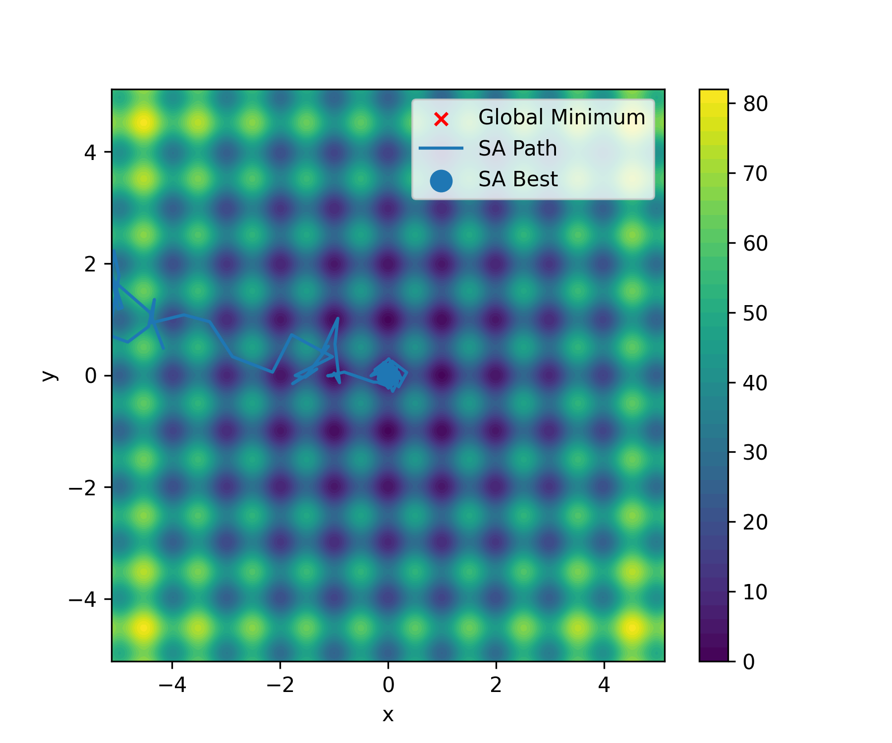

# Rastrigin Metaheuristic Optimization (Hill Climbing, Random Restart, Simulated Annealing)

A compact, reproducible university project that minimizes the **2D Rastrigin function** using:
- **Hill Climbing** (local, greedy heuristic)
- **Random Restart Hill Climbing** (multiple initializations to reduce local-trap sensitivity)
- **Simulated Annealing** (metaheuristic with controlled exploration)

The project includes:
- Clear **visualization** of the optimization path on the Rastrigin landscape
- Saved **final best objective value**
- A short **report** for academic submission

---

## Simulated Annealing Result (2D Rastrigin)



*Figure: Simulated Annealing path on the Rastrigin function.
The irregular trajectory demonstrates the ability of the metaheuristic
to escape local minima and converge near the global optimum.*

---

## Problem Statement

The **Rastrigin function** is a standard benchmark for optimization:

- Highly **multimodal** (many local minima)
- Difficult for purely local greedy methods
- Global minimum at **(0, 0)** with **f(x)=0**

This project demonstrates why simple heuristics get trapped and how metaheuristics (and restarts) help escape local minima.

---

## Repository Structure

```
rastrigin-metaheuristic-optimization/
├─ src/
│  ├─ rastrigin.py               # Rastrigin function + 2D landscape plot
│  ├─ hill_climbing.py           # Hill Climbing + Random Restart + main runner
│  ├─ simulated_annealing.py     # Simulated Annealing + SA with restarts
│  └─ utils.py                   # Shared utilities (bounds, clamp, stats runner)
│
├─ visualizations/
│  └─ simulated_annealing_path.png   # Final saved figure (SA path on landscape)
│
├─ results/
│  └─ sa_best.txt                    # Saved best objective value (SA best)
│
├─ report/
│  ├─ report.md                      # Short academic report
│  └─ .gitkeep                       # Keeps folder tracked in Git
│
├─ README.md
├─ requirements.txt
└─ LICENSE
```

---

## Outputs (Exact, Reproducible)

### 1) Final Visualization (Saved)

* **File:** `visualizations/simulated_annealing_path.png`
* **What it shows:** Rastrigin 2D contour plot + **Simulated Annealing path** + best point

### 2) Final Best Value (Saved)

* **File:** `results/sa_best.txt`
* **What it contains:** the best objective value obtained in the final run (floating number)

Example console line (your run may vary slightly depending on settings):

```text
SA best value (visualized): 3.189127025038374e-05
```

---

## How to Run

### 1) Create environment (recommended)

```bash
python -m venv .venv
```

**Windows (PowerShell)**

```bash
.\.venv\Scripts\Activate.ps1
```

**macOS / Linux**

```bash
source .venv/bin/activate
```

### 2) Install dependencies

```bash
pip install -r requirements.txt
```

### 3) Run the project

From the repository root:

```bash
cd src
python hill_climbing.py
```

This will:

* Run experiments (stats for Random Restart and SA)
* Generate a final SA visualization
* Save:

  * `../visualizations/simulated_annealing_path.png`
  * `../results/sa_best.txt`

---

## Algorithms

### Hill Climbing (Heuristic)

A greedy local search method:

* Evaluates neighbors around the current point
* Moves only if an improvement is found
* **Stops** at the first local optimum (often far from the global minimum)

**Key limitation:** easily trapped in local minima.

---

### Random Restart Hill Climbing (Heuristic Enhancement)

Runs Hill Climbing multiple times from different random starting points:

* Reduces dependence on the initial state
* Increases chance of finding a better local optimum

**Still greedy**, but more robust than a single start.

---

### Simulated Annealing (Metaheuristic)

Inspired by physical annealing:

* Accepts worse solutions with probability `exp(-ΔE/T)`
* Temperature decreases gradually (cooling schedule)
* Balances exploration (early) and exploitation (late)

In this project, SA is implemented with practical engineering features:

* **Bounded search space**: keeps solutions within valid domain
* **Adaptive step size**: step decreases as temperature cools
* **Multiple restarts** (optional but used here for stability)

---

## Notes on Reproducibility

* Randomness is controlled via a fixed seed in the main runner.
* If you remove the seed, results will vary per run (expected behavior).

---

## Report

A short academic report is included here:

* `report/report.md`

It contains:

* Problem description
* Algorithm summaries
* Key results
* Conclusion

---

## Requirements

The project uses:

* Python 3.x
* NumPy
* Matplotlib

See `requirements.txt`.

---

## License

This project is licensed under the terms of the included `LICENSE` file.

---

## Author / Course Context (Optional)

This repository was developed as a university assignment to practice:

* heuristic search
* metaheuristic optimization
* benchmarking and visualization on multimodal functions

```
